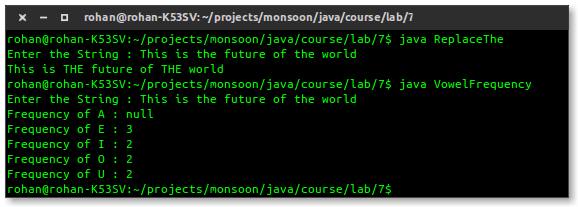

#Java Assignment 3
Submitted by *Rohan Verma*, **1510110508**

Contains all the code of Non Graded Labs of CSD 206 (Monsoon 2015, Shiv Nadar University)

The code is also uploaded to <https://github.com/rhnvrm/java_learn> and the commit history is available at <https://github.com/rhnvrm/java_learn/commits/master>

##Lab 0

###WelcomeJava.java

```java
public class WelcomeJava{
	public static void main(String[] args){
		System.out.println("Welcome");
	}
}

```

###WelcomeJava2.java

```java
import javax.swing.JOptionPane;

public class WelcomeJava2{
	public static void main(String[] args){
		JOptionPane.showMessageDialog(null, "Welcome to Java");
		JOptionPane.showMessageDialog(null, "Welcome to Java 3", "GUI Welcome", 3);
		JOptionPane.showMessageDialog(null, "Welcome to Java 3", "GUI Welcome", 2);
		JOptionPane.showMessageDialog(null, "Welcome to Java 3", "GUI Welcome", JOptionPane.QUESTION_MESSAGE);
	}
}
```

### ComputeArea.java

```java
import javax.swing.JOptionPane;
 

public class ComputeArea{
	public static void main(String[] args){
		float radius = 0;
		double area;

		area = radius * radius * 3.14159;

	    for (String s: args) {
            radius = Float.parseFloat(s);
            area = radius * radius * 3.14159;
            System.out.println("Area of circle of radius " + radius + " = " + area);
        }


	}
}
```

###ScannerExample.java

```java
import javax.swing.JOptionPane;
import java.util.Scanner;

public class ScannerExample{
	public static void main(String[] args){
		
		Scanner input = new Scanner(System.in);

		System.out.print("Enter an integer for seconds: ");
		int seconds = input.nextInt();
		int minutes = seconds/60;
		int remainingSeconds = seconds % 60;

		JOptionPane.showMessageDialog(null, seconds +  " seconds is " + minutes + " minutes and " + remainingSeconds + " seconds", "ScannerExample", -1);

	}
}
```

##Lab 1
###Lottery.java
```java
package lottery;

import java.util.Scanner;

/**
 *
 * @author rv285
 */
public class Lottery {

    /**
     * @param args the command line arguments
     */
    public static void main(String[] args) {
        
        int randNum1, randNum2, userNumber;
        randNum1 = (int) (Math.random() * 10);
        randNum2 = (int) (Math.random() * 10);
        
        Scanner s = new Scanner(System.in);
        
        userNumber = s.nextInt();
        
        int matches = 0;
        while(userNumber != 0){
            
            int digit = userNumber % 10;
            
            if(digit == randNum1) matches+=1;
            if(digit == randNum2) matches+=1;
            
            userNumber /= 10;
        }
        
        if(matches == 2) System.out.println("You have won 3000 USD!");
        else if(matches == 1) System.out.println("You have won 1000 USD!");
        else System.out.println("Better Luck Next Time!");
        
    }
}
```

###Lottery2.java
```java
/*
 * To change this template, choose Tools | Templates
 * and open the template in the editor.
 */
package lottery;

import java.util.Scanner;
import javax.swing.*;


/**
 *
 * @author rv285
 */
public class Lottery2 {

    /**
     * @param args the command line arguments
     */
    public static void main(String[] args) {
        // TODO code application logic here
        int randNum1, randNum2, userNumber;
        randNum1 = (int) (Math.random() * 10);
        randNum2 = (int) (Math.random() * 10);
        
        //Scanner s = new Scanner(System.in);
        //userNumber = s.nextInt();

        //debug
        //System.out.println(randNum1+(randNum2*10));
        
        userNumber = Integer.parseInt(JOptionPane.showInputDialog("Enter a two digit number"));
                
        boolean exactMatch = false;
        
        //check exact match
        if(randNum1+(randNum2*10) == userNumber) exactMatch = true;
                      
        if(exactMatch){
            JOptionPane.showMessageDialog(null, "You have won 10000 USD!");
        }
        //else
        else{
            int matches = 0;
            while(userNumber != 0){

                int digit = userNumber % 10;

                if(digit == randNum1) matches+=1;
                if(digit == randNum2) matches+=1;

                userNumber /= 10;
            }

            if(matches >= 2) JOptionPane.showMessageDialog(null, "You have won 3000 USD!");
            else if(matches == 1) JOptionPane.showMessageDialog(null, "You have won 1000 USD!");
            else JOptionPane.showMessageDialog(null, "Better Luck Next Time!");
        }
    }
}
```

###InsideCircle.java
```java
/*
 * To change this template, choose Tools | Templates
 * and open the template in the editor.
 */
package insidecircle;

import java.util.Scanner;

/**
 *
 * @author rv285
 */
public class InsideCircle {

    /**
     * @param args the command line arguments
     */
    public static void main(String[] args) {
        // TODO code application logic here

        double x,y,r;
        Scanner s = new Scanner(System.in);
        
        x = s.nextDouble();
        y = s.nextDouble();
        r = s.nextDouble();
               
        double LHS = Math.pow(x,2) + Math.pow(y,2);
        double RHS = Math.pow(r,2);
        
        if(LHS <= RHS){
            System.out.println("The point is inside or on the circle");
        }
        else{
            System.out.println("The point is outside the circle");
        }
              
    }
}
```

###Quadratic.java
```java
/*
 * To change this template, choose Tools | Templates
 * and open the template in the editor.
 */
package quadratic;

import java.util.Scanner;

/**
 *
 * @author rv285
 */
public class Quadratic {

    /**
     * @param args the command line arguments
     */
    public static void main(String[] args) {
        // TODO code application logic here
        double a,b,c,d,r;
        
        //a = 1;
        Scanner s = new Scanner(System.in);
        
        a = s.nextDouble();
        b = s.nextDouble();
        c = s.nextDouble();
        
        d = Math.pow(b,2) - 4*a*c;
        
        if(d == 0){
            System.out.println("Root:");
            r = (-b)/(2*a);
            System.out.println(r);
        }
        else if (d > 0){
            System.out.println("Roots:");
            
            r = ((-b) + d)/(2*a);
            System.out.println(r);

            r = ((-b) - d)/(2*a);
            System.out.println(r);

        }
        else {
            System.out.println("The equation has no real roots.");
        }
        
        
    }
}
```

##Lab 2
Create a package SNU.geometryUtil. Define Classes For various 2-d shapes like Circle, Triangle, Square, Rectangle. Create variables, required constructors, methods for calculating areas, perimeters, for each type of shape. Create Mainclass having “ public static void main()” method in another package. Create menu driven program asking user to create a new object of any of the shape, show him the count of each object created, asking him to show any property of any of the object, calculate area or perimeter of any object.

### Compiling
`javac *.java -d .`

###Testing
`java Test.Mainclass`


###Circle.java
```java
package SNU.geometryUtil;

public class Circle{
    private double radius;

    private static int counter = 0;

    public Circle(){
        counter++;
    }

    public Circle(double x){
        radius = x;
        counter++;
    }

    public static int getCounter(){
        return counter;
    }

    public double getRadius(){
        return radius;
    }

    public void setRadius(double x){
        radius = x;
    }

    public double getArea(){
        return 3.1415 * radius * radius;
    }
    public double getPerimeter(){
        return 2* 3.1415 * radius ;
    }
}

```

###Rectangle.java
```java
package SNU.geometryUtil;


public class Rectangle{
    private double l,b;
    
    private static int counter = 0;

    public Rectangle(){
        counter++;
    }

    public Rectangle(double x, double y){
        l = x;
        b = y;
        counter++;
    }

    public static int getCounter(){
        return counter;
    }

    public double getL(){
        return l;
    }
    public double getB(){
        return b;
    }

    public void setL(double x){
        l = x;
    }
    public void setB(double x){
        b = x;
    }


    public double getPerimeter(){
        return 2.0*(l+b);
    }

    public double getArea(){
        return l*b;
    }

}
```

###Square.java
```java
package SNU.geometryUtil;


public class Square{
    private double a;

    private static int counter = 0;

    public Square(){
        counter++;
    }

    public Square(double x){
        a = x;
        counter++;
    }

    public static int getCounter(){
        return counter;
    }

    public double getA(){
        return a;
    }

    public void setA(double x){
        a = x;
    }


    public double getPerimeter(){
        return 4.0*a;
    }

    public double getArea(){
        return a*a;
    }

}
```

###Triangle.java
```java
package SNU.geometryUtil;


public class Triangle{
    private double a,b,c;

    private static int counter = 0;

    public Triangle(){
        counter++;
    }

    public static int getCounter(){
        return counter;
    }

    public Triangle(double x,double y,double z){
        a = x;
        b = y;
        c = z;
        counter++;
    }

    public double getA(){
        return a;
    }

    public double getB(){
        return b;
    }

    public double getC(){
        return c;
    }

    public void setA(double x){
        a = x;
    }

    public void setB(double x){
        b = x;
    }

    public void setC(double x){
        c = x;
    }

    public double getPerimeter(){
        return a+b+c;
    }

    public double getArea(){
        double p = getPerimeter()/2.0;

        return Math.sqrt(p*(p-a)*(p-b)*(p-c));
    }

}
```

###Mainclass.java
```java
package Test;

import SNU.geometryUtil.*;

import java.util.*;

public class Mainclass{
    
    public static void main(String args[]){

        Circle[] circles = new Circle[11]; //0

        Rectangle[] rect = new Rectangle[11]; // 1

        Square[] square = new Square[11]; //2

        Triangle[] triangles = new Triangle[11]; //3


        System.out.println("Welcome to Test Module for SNU.geometryUtil");

        Scanner in = new Scanner(System.in);
        int choice  = -1;
        while(choice != 0){
            System.out.println("New Object or Browse? <1,2,[0-exit]>");
            choice = in.nextInt();
            
            if(choice == 0) System.exit(0);

            System.out.println("Choose Object type (Circle, Rectangle, Square, Triangle <0,1,2,3>");
            int object = in.nextInt();
            
            if(object == 0) {
                if(choice == 1){
                    Double input = in.nextDouble();
                    circles[Circle.getCounter()] = new Circle(input);
                }
                if(choice == 2){
                    for(int i = 0; i < Circle.getCounter(); i++){
                        System.out.println("Circle #"+i+" -> "+ "Area: " + circles[i].getArea() + " Perim: " + circles[i].getPerimeter());
                    }
                }
            }
            else if(object == 1){
                if(choice == 1){
                    Double l = in.nextDouble();
                    Double b = in.nextDouble();
                    rect[Rectangle.getCounter()] = new Rectangle(l,b);
                }
                if(choice == 2){
                    for(int i = 0; i < Circle.getCounter(); i++){
                        System.out.println("Rect #"+i+" -> "+ "Area: " + rect[i].getArea() + " Perim: " + rect[i].getPerimeter());
                    }
                }
            }
            else if(object == 2){
                if(choice == 1){
                    Double a = in.nextDouble();
                    
                    square[Square.getCounter()] = new Square(a);
                }
                if(choice == 2){
                    for(int i = 0; i < Square.getCounter(); i++){
                        System.out.println("Sqr #"+i+" -> "+ "Area: " + square[i].getArea() + " Perim: " + square[i].getPerimeter());
                    }
                }
            }
            else if(object == 3){
                if(choice == 1){
                    Double a = in.nextDouble();
                    Double b = in.nextDouble();
                    Double c = in.nextDouble();
                    
                    triangles[Triangle.getCounter()] = new Triangle(a,b,c);
                }
                if(choice == 2){
                    for(int i = 0; i < Square.getCounter(); i++){
                        System.out.println("Sqr #"+i+" -> "+ "Area: " + square[i].getArea() + " Perim: " + square[i].getPerimeter());
                    }
                }
            }
        }
    }
}


```

##Lab 3
Define two classes.

1. **Name**. Having at least three components the First name, Middle Name and the Last Name. Add appropriate constructors. 

Add methods to check sameNames, e.g. name1= Saurabh Kulshreshtha, ame2=Saurabh Kulshreshtha/ saurabh kulshreshtha.... sameInitials, e.g. name1=Ram Vashishtha, name2=Ravi Verma similarNames (When some of the first, middle or last names have been exchanged.),e.g. (Ravi Verma and Verma Ravi) or (Venkat Sai Velluri and Velluri Sai Venkat and Sai Velluri Venkat) etc. maybeSameNames (when some names contains initials in place of First, Middle and/or Last names and they are same as initials of other complete names) e.g. L. R. Ramesh, Luxmi Rama Ramesh, 

2. **Student**. Has three names studentName, FathersName, MothersName. Constructors, Accessors/Mutators.

3. **Main Program**. Array of Students. Answer.... How many have same names, same fathers name etc..


###Name.java
```java
package Lab3;

import java.util.*;

public class Name{
    String firstName;
    String lastName;
    String middleName;

    public Name(String x){
        String a[] = new String[3];
        a = x.split(" ", 3);

        if(a.length == 3){
            firstName = a[0];
            lastName = a[2];
            middleName = a[1];
        }
        else if(a.length == 2){
            firstName = a[0];
            lastName = a[1];
        }
        else{
            firstName = x;
        }
        
    }

    public void setName(String x){
        String a[] = new String[3];
        a = x.split(" ", 3);

        if(a.length == 3){
            firstName = a[0];
            lastName = a[2];
            middleName = a[1];
        }
        else if(a.length == 2){
            firstName = a[0];
            lastName = a[1];
        }
        else{
            firstName = x;
        }
    }

    public String getName(){
        String s = firstName;
        if(middleName != null) s = s.concat(" " + middleName);
        if(lastName != null) s = s.concat(" " + lastName);

        return s;
    }

    public boolean sameName(Name x){
        if(this.getName().toLowerCase().compareTo(x.getName().toLowerCase()) == 0) return true;
        else return false;
    }

    public boolean similarName(Name x){
        
        String[] a = new String[3];
        a = x.getName().split(" ", 3);
        Arrays.sort(a);

        String[] b = new String[3];
        b = this.getName().split(" ", 3);
        Arrays.sort(b);
        
        return Arrays.equals(a,b);
    }

    public boolean maybeSameName(Name x){
        
        String[] a = new String[3];
        a = x.getName().split(" ", 3);
        

        //Arrays.sort(a);

        String[] b = new String[3];
        b = this.getName().split(" ", 3);
//          System.out.println(b[0]);

        for(int i = 0; i < a.length; i++){
            a[i] = a[i].substring(0,1);
            //System.out.println(a[i]);
        }
        //Arrays.sort(b);
        
        for(int i = 0; i < b.length; i++){
            b[i] = b[i].substring(0,1);
            //System.out.println(b[i]);
        }
        return Arrays.equals(a,b);
    }

}
```

###Student.java
```java
package Lab3;

import java.util.*;

public class Student{
    Name studentName = new Name("");
    Name fathersName = new Name("");
    Name mothersName = new Name("");

    public Student(String s, String f, String m){
        studentName.setName(s);
        fathersName.setName(f);
        mothersName.setName(m);
    }

    public Name getStudentName(){
        return studentName;
    }

    public Name getFathersName(){
        return fathersName;
    }

    public Name getMothersName(){
        return mothersName;
    }

    public void setStudentName(String x){
        studentName.setName(x);
    }


    public void setFathersName(String x){
        fathersName.setName(x);
    }

    public void setMothersName(String x){
        mothersName.setName(x);
    }


}
```


###Mainclass.java
```java
package Lab3;

import java.util.*;

public class Mainclass{
    
    public static void main(String args[]){

        Student arr[] = new Student[5];

        arr[0] = new Student("John Doe", "Bob Doe", "Lisa Doe");
        arr[1] = new Student("john doe", "Bob Doe", "Lisa Doe");
        arr[2] = new Student("joseph donalad", "Bob Doe", "Lisa Doe");
        arr[3] = new Student("Jack Daniels", "Bob Doe", "Lisa Doe");
        arr[4] = new Student("Doe John", "Bob Doe", "Lisa Doe");


        int countSameName = 0, countSimilarName = 0, countMaybeSameName = 0;

        for(int i = 0; i < 5; i++){
            for(int j = 0; j < 5; j++){
                if(i != j && i < j){
                    if(arr[i].getStudentName().sameName(arr[j].getStudentName())) countSameName++;
                    if(arr[i].getStudentName().similarName(arr[j].getStudentName())) countSimilarName++;
                    if(arr[i].getStudentName().maybeSameName(arr[j].getStudentName())) countMaybeSameName++;
                }
            }
        }

        System.out.println("Same Names:       " + countSameName);
        System.out.println("Similar Names:    " + countSimilarName);
        System.out.println("Maybe Same Names: " + countMaybeSameName);
    }
}

```


##Lab 4

###Questions

1. Design a class named Person and its two subclasses named Student and Employee . Make Faculty and Staff subclasses of Employee . A person has a name, address, phone number, and email address. A student has a class status (freshman, sophomore, junior, or senior). Define the status as a constant. An employee has an office, salary, and date hired. Define a class named MyDate that contains the fields year , month , and day . A faculty member has office hours and a rank. A staff member has a title. Override the toString method in each class to display the class name and the person’s name.Write a test program that creates a Person , Student , Employee , Faculty , and Staff , and invokes their toString() methods. 
2. Define the Triangle class with three sides. In a triangle, the sum of any two sides is greater than the other side. The Triangle class must adhere to this rule. Create the IllegalTriangleException class, and modify the  constructor of the Triangle class to throw an IllegalTriangleException object if a triangle is created with sides that violate the rule.

Source Files in Ascending order of filename.


###Employee.java
```java
package SNU;

public class Employee extends Person {

    protected double salary;
    protected String office;
    protected MyDate dateHired;

    public Employee(String name) {
        this(name, 0, "none", new MyDate());
    }

    public Employee(String name, double salary, String office, MyDate dateHired) {
        super(name);
        this.salary = salary;
        this.office = office;
        this.dateHired = dateHired;
    }

    public double getSalary() {
        return salary;
    }

    public void setSalary(double salary) {
        this.salary = salary;
    }

    public String getOffice() {
        return office;
    }

    public void setOffice(String office) {
        this.office = office;
    }

    public MyDate getDateHired() {
        return dateHired;
    }

    public void setDateHired(MyDate dateHired) {
        this.dateHired = dateHired;
    }

    @Override
    public String toString() {
        return "Name: " + getName() + " Class: " + this.getClass().getName();
    }
}
```

###Faculty.java
```java
package SNU;

public class Faculty extends Employee {

    public static String LECTURER = "Lecturer";
    public static String ASSISTANT_PROFESSOR = "Assistant Professor";
    public static String ASSOCIATE_PROFESSOR = "Associate Professor";
    public static String PROFESSOR = "Professor";

    protected String officeHours;
    protected String rank;

    public Faculty(String name) {
        this(name, "9-5PM", "Employee");
    }

    public Faculty(String name, String officeHours, String rank) {
        super(name);
        this.officeHours = officeHours;
        this.rank = rank;
    }

    public String getOfficeHours() {
        return officeHours;
    }

    public void setOfficeHours(String officeHours) {
        this.officeHours = officeHours;
    }

    public String getRank() {
        return rank;
    }

    public void setRank(String rank) {
        this.rank = rank;
    }

    @Override
    public String toString() {
        return "Name: " + getName() + " Class: " + this.getClass().getName();
    }
}
```

###GeometricObject.java
```java
package SNU;

public abstract class GeometricObject implements Comparable<GeometricObject> {
    private String color = "white";
    private boolean filled;
    private java.util.Date dateCreated;

    /** Construct a default geometric object */
    protected GeometricObject() {
        dateCreated = new java.util.Date();
    }

    /** Construct a geometric object with color and filled value */
    protected GeometricObject(String color, boolean filled) {
        dateCreated = new java.util.Date();
        this.color = color;
        this.filled = filled;
    }

    /** Return color */
    public String getColor() {
        return color;
    }

    /** Set a new color */
    public void setColor(String color) {
        this.color = color;
    }

    /** Return filled. Since filled is boolean,
     *  the get method is named isFilled */
    public boolean isFilled() {
        return filled;
    }

    /** Set a new filled */
    public void setFilled(boolean filled) {
        this.filled = filled;
    }

    /** Get dateCreated */
    public java.util.Date getDateCreated() {
        return dateCreated;
    }

    /** Return a string representation of this object */
    @Override
    public String toString() {
        return "created on " + dateCreated + "\ncolor: " + color +
                " and filled: " + filled;
    }

    @Override
    public int compareTo(GeometricObject o) {
        if (getArea() > o.getArea())
            return 1;
        else if (getArea() < o.getArea())
            return -1;
        else
            return 0;
    }

    public static GeometricObject max(GeometricObject o1, GeometricObject o2) {
        return (o1.compareTo(o2) >= 0) ? o1 : o2;
    }

    public static double sumArea(GeometricObject[] a) {
        double sum = 0;
        for (GeometricObject o : a) {
            sum += o.getArea();
        }
        return sum;
    }
    /** Abstract method getArea */
    public abstract double getArea();

    /** Abstract method getPerimeter */
    public abstract double getPerimeter();
}
```

###MyDate.java
```java
package SNU;

import java.util.Calendar;
import java.util.GregorianCalendar;

public class MyDate {

    private int year;
    private int month;
    private int day;

    public MyDate() {

        GregorianCalendar cal = new GregorianCalendar();
        year = cal.get(Calendar.YEAR);
        month = cal.get(Calendar.MONTH);
        day = cal.get(Calendar.DAY_OF_MONTH);

    }

    public MyDate(long elapsedTime) {
        GregorianCalendar cal = new GregorianCalendar();
        cal.setTimeInMillis(elapsedTime);
        year = cal.get(Calendar.YEAR);
        month = cal.get(Calendar.MONTH);
        day = cal.get(Calendar.DAY_OF_MONTH);
    }

    public MyDate(int year, int month, int day) {
        this.year = year;
        this.month = month;
        this.day = day;
    }

    public int getYear() {
        return year;
    }

    public void setYear(int year) {
        this.year = year;
    }

    public int getMonth() {
        return month;
    }

    public void setMonth(int month) {
        this.month = month;
    }

    public int getDay() {
        return day;
    }

    public void setDay(int day) {
        this.day = day;
    }

    public void setDate(long elapsedTime) {
        GregorianCalendar cal = new GregorianCalendar();
        cal.setTimeInMillis(elapsedTime);
        year = cal.get(Calendar.YEAR);
        month = cal.get(Calendar.MONTH);
        day = cal.get(Calendar.DAY_OF_MONTH);
    }
}
```

###PeopleTest.java
```java
package Test;

import SNU.*;

public class PeopleTest {

    public static void main(String[] args) {

        Person person = new Person("person");
        Student student = new Student("student");
        Employee employee = new Employee("employee");
        Faculty faculty = new Faculty("faculty");
        Staff staff = new Staff("staff");

        System.out.println(person.toString());
        System.out.println(student.toString());
        System.out.println(employee.toString());
        System.out.println(faculty.toString());
        System.out.println(staff.toString());

    }


}
```

###Person.java
```java
package SNU;


public class Person {

    protected String name;
    protected String address;
    protected String phoneNumber;
    protected String email;

    public Person(String name) {
        this.name = name;
    }

    public String getName() {
        return name;
    }

    public void setName(String name) {
        this.name = name;
    }

    public String getAddress() {
        return address;
    }

    public void setAddress(String address) {
        this.address = address;
    }

    public String getPhoneNumber() {
        return phoneNumber;
    }

    public void setPhoneNumber(String phoneNumber) {
        this.phoneNumber = phoneNumber;
    }

    public String getEmail() {
        return email;
    }

    public void setEmail(String email) {
        this.email = email;
    }

    @Override
    public String toString() {
        return "Name: " + getName() + " Class: " + this.getClass().getName();
    }
}
```

###Staff.java
```java
package SNU;

public class Staff extends Employee {

    protected String title;

    public Staff(String name) {
        this(name, "none");

    }

    public Staff(String name, String title) {
        super(name);
        this.title = title;
    }

    public String getTitle() {
        return title;
    }

    public void setTitle(String title) {
        this.title = title;
    }

    @Override
    public String toString() {
        return "Name: " + getName() + " Class: " + this.getClass().getName();
    }
}
```

###Student.java
```java
package SNU;

public class Student extends Person {

    public static final String FRESHMAN = "Freshman";
    public static final String SOPHOMORE = "Sophomore";
    public static final String JUNIOR = "Junior";
    public static final String SENIOR = "Senior";

    protected String status;

    public Student(String name) {
        super(name);
    }

    public Student(String name, String status) {
        super(name);
        this.status = status;
    }

    @Override
    public String toString() {
        return "Name: " + getName() + " Class: " + this.getClass().getName();
    }
}
```


###Triangle.java
```java
package SNU;

public class Triangle extends GeometricObject {

    private double side1;
    private double side2;
    private double side3;


    public Triangle(double side1, double side2, double side3) throws IllegalTriangleException {
        this.side1 = side1;
        this.side2 = side2;
        this.side3 = side3;
        isValidTriangle();
    }

    public Triangle() {
        this.side1 = 1;
        this.side2 = 1;
        this.side3 = 1;
    }

    @Override
    public double getArea() {

        double s = (side1 + side2 + side3) / 2.0;
        return Math.pow(s * (s - side1) * (s - side2) * (s - side3), 0.5);
    }

    @Override
    public double getPerimeter() {
        return side1 + side2 + side3;
    }

    @Override
    public String toString() {
        return "Triangle{" +
                "side1=" + side1 +
                ", side2=" + side2 +
                ", side3=" + side3 +
                '}';
    }

    public static boolean isTriangle(double side1, double side2, double side3) {

        return  ((side1 + side2 > side3) &&
                (side1 + side3 > side2) &&
                (side3 + side2 > side1));

    }

    public double getSide1() {
        return side1;
    }

    public void setSide1(double side1) throws IllegalTriangleException {
        this.side1 = side1;
        isValidTriangle();
    }

    public double getSide2() {
        return side2;
    }

    public void setSide2(double side2) throws IllegalTriangleException{
        this.side2 = side2;
        isValidTriangle();
    }

    public double getSide3() {
        return side3;
    }

    public void setSide3(double side3) throws IllegalTriangleException {
        this.side3 = side3;
        isValidTriangle();
    }

    private void isValidTriangle() throws IllegalTriangleException{
        if (!isTriangle(side1, side2, side3)) {
            throw new IllegalTriangleException(side1, side2, side3);
        }
    }

    public class IllegalTriangleException extends IllegalArgumentException {

        private double s1;
        private double s2;
        private double s3;

         public IllegalTriangleException(double s1, double s2, double s3) {
            super("Not a real triangle:" + " side1 = " + s1 + " side2 = " + s2 + " side3 = " + s3);
            this.s1 = s1;
            this.s2 = s2;
            this.s3 = s3;
        }

        public double getS1() {
            return s1;
        }

        public double getS2() {
            return s2;
        }

        public double getS3() {
            return s3;
        }


    }
}
```

###TriangleTest.java
```java
package Test;

import SNU.Triangle;
import SNU.Triangle.IllegalTriangleException;

public class TriangleTest {

    public static void main(String[] args) {

        Triangle t1;
        try {
            t1 = new Triangle(1, 1, 2000);
        } catch (IllegalTriangleException e) {
            e.printStackTrace();
        }

    }

}
```


##Lab 5

1. Define the abstract GeometricObject as the base class for all classes like Circle, Rectangle, Triangle... defined earlier. It should have abstract method getArea and getPerimeter. Define a generic method costOfPaintingashape(GeometricObject g) and use to find cost for different geometric objects placed in an array based on the User.
2. (Enabling GeometricObject comparable) Modify the GeometricObject class to implement the Comparable interface, and define a static max method in the GeometricObject class for finding the larger of two GeometricObject objects. Draw the UML diagram and implement the new GeometricObject class. Write a test program that uses the max method to find the larger of two circles and the larger of two rectangles. 
3. (The Colorable interface) Design an interface named Colorable with a void method named howToColor(). Every class of a colorable object must implement the Colorable interface. Design a class named Square that extends GeometricObject and implements Colorable. Implement howToColor to display a message "Color all four sides". Draw a UML diagram that involves Colorable, Square, and GeometricObject.
4. Write a test program that creates an array of five GeometricObjects. For each object in the array, invoke its howToColor method if it is colorable. 
5. (Finding the largest object) Write a method that returns the largest object in an array of objects. The method signature is: public static Object max(Comparable[] a) All the objects are instances of the Comparable interface. The order of the objects in the array is determined using the compareTo method. Write a test program that creates an array of ten strings, an array of ten integers, and an array of ten dates, and finds the largest string, integer, and date in the arrays.


###Circle.java
```java

package SNU;

public class Circle extends GeometricObject{
    private double rad;
    
    public Circle()
    {
        super();
    }
    public Circle(double rad, String color, boolean filled)
    {
        super(color,filled);
        this.rad = rad;
    }
    
    public void setRadius(double rad)
    {
        this.rad = rad;
    }
    public double getRadius()
    {
        return rad;
    }
    public double getDiameter()
    {
        return rad*2.0;
    }

    /**
     *
     * @return
     */
    @Override
    public double getArea()
    {
        return (rad*rad*Math.PI);
    }

    /**
     *
     * @return
     */
    @Override
    public double getPerimeter()
    {
        return (2.0 * rad * Math.PI);
    }
    @Override
    public void howToColor()
    {
        System.out.println("Color the circumference");
    }
    
}

```

###Colorable.java
```java

package SNU;

public interface Colorable {

    /**
     *
     */
    public abstract void howToColor();   
    
}

```

###GeoObj.java
```java
package SNU;

import static SNU.GeometricObject.max;
import java.util.Scanner;

public class GeoObj {

    /**
     * @param args the command line arguments
     */
    public static void main(String[] args) {
        GeometricObject[] objects = {new Circle(5.0,"red",true), new Circle(12.3,"",false), new Rectangle(3.0,4.0,"blue",true), new Rectangle(12.0,4.0,"",false)};
        Scanner input = new Scanner(System.in);
        int n,i;

        for(i=0;i < objects.length;i++)
        {
            costOfPaintingAShape(objects[i]);
            objects[i].howToColor();
        }
        for(i=0;i < objects.length - 1;i++)
        {
            max(objects[i],objects[i+1]);
        }
        
        
        // TODO code application logic here
    }
    
    public static void costOfPaintingAShape(GeometricObject obj)
    {
        double costPerUnitArea = 5.0, cost;
        
        if(obj.isFilled())
        System.out.println("Cost of painting is " + costPerUnitArea*obj.getArea());
    }
    
}

```

###GeometricObject.java
```java

package SNU;

import java.util.Date;

public abstract class GeometricObject implements Comparable<GeometricObject>,Colorable{
    private String color;
    private boolean filled;
    private Date dateCreated;
    
    protected GeometricObject()
    {
        dateCreated = new Date();
    }
    protected GeometricObject(String color, boolean filled)
    {
        dateCreated = new Date();
        this.color = color;
        this.filled = filled;
    }
    
    public String getColor() 
    {
        return color;
    }
    public void setColor(String color)
    {
        this.color = color;
    }
    public boolean isFilled()
    {
        return filled;
    }
    public void setFilled(boolean filled)
    {
        this.filled = filled;
    }
    public Date getDate()
    {
        return dateCreated;
    }
    public static void max(GeometricObject obj1, GeometricObject obj2)
    {
        System.out.println("obj"+obj1.compareTo(obj2)+" is greater");
    }
    @Override
    public int compareTo(GeometricObject o)
    {
        if(getArea() > o.getArea())
            return 1;
        else if(getArea() < o.getArea())
            return 2;
        else
            return -1;
    }
    @Override
    public abstract void howToColor();
    
    public abstract double getArea();
    public abstract double getPerimeter();
     
    
}

```

###Rectangle.java
```java

package SNU;

public class Rectangle extends GeometricObject implements Colorable{
    private double width,height;
    
    public Rectangle()
    {
        super();
    }
    public Rectangle(double width, double height, String color, boolean filled)
    {
        super(color,filled);
        this.width = width;
        this.height = height;
    }
    
    public void setWidth(double width)
    {
        this.width = width;
    }
    public double getWidth()
    {
        return width;
    }
    public void setHeight(double height)
    {
        this.height = height;
    }
    public double getHeight()
    {
        return height;
    }
    
    /**
     *
     * @return
     */
    @Override
    public double getArea()
    {
        return (height*width);
    }

    /**
     *
     * @return
     */
    @Override
    public double getPerimeter()
    {
        return (2.0 * (width+height));
    }
    @Override
    public void howToColor()
    {
        System.out.println("Color all 4 sides");
    }
    
}

```


##Lab 6

### Question 1

Write a program that draws a fixed circle, rectangle and triangle. Whenever a mouse is moved, display the message indicating whether the mouse point is inside the figure, as shown in figures below.

###A.java (Circle)


```java
package q1;

import javax.swing.*;
import java.awt.*;
import java.awt.event.MouseAdapter;
import java.awt.event.MouseEvent;

@SuppressWarnings("serial")
public class A extends JFrame {
    
    private static JLabel jlabel = new JLabel("Mouse is outside!");
    
    private static int circleX=50, circleY=15, circleWidth=100, centerX=circleX + circleWidth/2, centerY=circleY  + circleWidth/2;
    
    public static double distance(
            double x1, double y1, double x2, double y2) {
        return Math.sqrt((x2 - x1) * (x2 - x1) + (y2 - y1) * (y2 - y1));
    }

    
    public boolean isInsideCircle(int px, int py) {
        return distance(px, py, centerX, centerY) < circleWidth/2;
    }
    
    public A()
    {
    
     //Set JFrame title
     super("Q1a");

     //Set default close operation for JFrame
     setDefaultCloseOperation(JFrame.EXIT_ON_CLOSE);

     //Set JFrame size
     setSize(300,150);

     //Make JFrame visible 
     setVisible(true);
     
     this.addMouseMotionListener(new MouseAdapter() {
        
        @Override
        public void mouseMoved(MouseEvent e) {
            
            super.mouseMoved(e);
            
            //jlabel.setText(""+isInsideCircle(e.getX(),e.getY())+" "+e.getX()+" "+e.getY());
            
            if(isInsideCircle(e.getX(),e.getY())){
                jlabel.setText("Mouse is inside!");
            }
            else{
                jlabel.setText("Mouse is outside!");
            }

            repaint();
        }
        
         
         
    });
    }


    
    public void paint(Graphics g)
    {
     super.paint(g);

        g.drawOval(circleX, circleY, circleWidth, circleWidth);
        
        
    }

    public static void main(String[] args) {

        A frame = new A();
        
        
        
        frame.add(jlabel);
        
    }

}
```

###B.java (Rectange)


```java
package q1;

import javax.swing.*;
import java.awt.*;
import java.awt.event.MouseAdapter;
import java.awt.event.MouseEvent;

@SuppressWarnings("serial")
public class B extends JFrame {
    
    private static JLabel jlabel = new JLabel("Mouse is outside!");
    
    private static int rectX=50, rectY=15, rectWidth=200, rectHeight=100;
    
    public static double distance(
            double x1, double y1, double x2, double y2) {
        return Math.sqrt((x2 - x1) * (x2 - x1) + (y2 - y1) * (y2 - y1));
    }

    
    public boolean isInsideRect(int px, int py) {
        return px < rectX+rectWidth && py < rectY+rectHeight && px > rectX && py > rectY;
    }
    
    public B()
    {
    
     //Set JFrame title
     super("Q1b");

     //Set default close operation for JFrame
     setDefaultCloseOperation(JFrame.EXIT_ON_CLOSE);

     //Set JFrame size
     setSize(300,200);

     //Make JFrame visible 
     setVisible(true);
     
     this.addMouseMotionListener(new MouseAdapter() {
        
        @Override
        public void mouseMoved(MouseEvent e) {
            
            super.mouseMoved(e);
            
            //jlabel.setText(""+isInsideRect(e.getX(),e.getY())+" "+e.getX()+" "+e.getY());
            
            if(isInsideRect(e.getX(),e.getY())){
                jlabel.setText("Mouse is inside!");
            }
            else{
                jlabel.setText("Mouse is outside!");
            }

            repaint();
        }
        
         
         
    });
    }


    
    public void paint(Graphics g)
    {
     super.paint(g);

        g.drawRect(rectX, rectY, rectWidth, rectHeight);
        
        
    }

    public static void main(String[] args) {

        B frame = new B();
        
        
        
        frame.add(jlabel);
        
    }

}
```

###C.java (Triangle)


```java
package q1;

import javax.swing.*;
import java.awt.*;
import java.awt.event.MouseAdapter;
import java.awt.event.MouseEvent;

import SNU.gr3.Point;

@SuppressWarnings("serial")
public class C extends JFrame {
    
    private static JLabel jlabel = new JLabel("Mouse is outside!");
    
    private  Point a = new Point(),b= new Point(),c=new Point();
    
    private static double distance(
            double x1, double y1, double x2, double y2) {
        return Math.sqrt((x2 - x1) * (x2 - x1) + (y2 - y1) * (y2 - y1));
    }

    private int sign(int n){
        return Math.abs(n)/n;
    }

    private int dotProduct(Point A, Point B, Point P){
        return (A.getX()-P.getX())*(B.getY()-P.getY())-(B.getX()-P.getX())*(A.getY()-P.getY());
    }

    public boolean isInside(int x, int y) {

        Point p = new Point(x,y);

        int ab = dotProduct(a,b,p);
        int bc = dotProduct(b,c,p);
        int ca = dotProduct(c,a,p);
        return sign(ab)==sign(bc) && sign(bc)==sign(ca);

        
    }
    
    public C()
    {

        super("Q1c");

        a.setX(0);
        a.setY(75);
        b.setX(90);
        b.setY(90);
        c.setX(50);
        c.setY(0);
    
     //Set JFrame title
     

     //Set default close operation for JFrame
     setDefaultCloseOperation(JFrame.EXIT_ON_CLOSE);

     //Set JFrame size
     setSize(300,200);

     //Make JFrame visible 
     setVisible(true);
     
     this.addMouseMotionListener(new MouseAdapter() {
        
        @Override
        public void mouseMoved(MouseEvent e) {
            
            super.mouseMoved(e);
            
            //jlabel.setText(""+isInside(e.getX(),e.getY())+" "+e.getX()+" "+e.getY());
            
            //repaint();

            if(isInside(e.getX(),e.getY())){
                jlabel.setText("Mouse is inside!");
            }
            else{
                jlabel.setText("Mouse is outside!");
            }

            repaint();
        }
        
         
         
    });
    }


    
    public void paint(Graphics g)
    {
     super.paint(g);

        g.drawLine(a.getX(),a.getY(),b.getX(),b.getY());
        g.drawLine(b.getX(),b.getY(),c.getX(),c.getY());
        g.drawLine(c.getX(),c.getY(),a.getX(),a.getY());
        
    }

    public static void main(String[] args) {

        C frame = new C();
        
        frame.add(jlabel);
        frame.repaint();
        
    }

}
```

### Question 2

Write a program that displays a circle. You can point the mouse inside the circle and drag (i.e.,move with mouse pressed) the circle wherever the mouse goes, as shown in Figure below.


### DraggableCircle.java
```java
package q2;

import java.awt.*;
import java.awt.event.*;

import javax.swing.*;

@SuppressWarnings("serial")
public class DraggableCircle extends JFrame{

    CirclePanel canvas = new CirclePanel();
    
    public DraggableCircle() {
        // TODO Auto-generated constructor stub
        
        this.add(canvas);
        
        
    }
    
    class CirclePanel extends JPanel{
        int x= 100, y = 100, diameter = 50;
        
        public boolean isInsideCircle(int px, int py) {
            return distance(px, py, x-diameter/2, y-diameter/2) < diameter;
        }

        public double distance(
                double x1, double y1, double x2, double y2) {
            return Math.sqrt((x2 - x1) * (x2 - x1) + (y2 - y1) * (y2 - y1));
        }
        
        public CirclePanel() {
            // TODO Auto-generated constructor stub
            this.addMouseMotionListener(new MouseAdapter() {
                
                /*@Override
                public void mouseReleased(MouseEvent e) {
                    // TODO Auto-generated method stub
                    x = e.getX();
                    y = e.getY();
                    repaint();
                }*/
                /*
                @Override
                public void mousePressed(MouseEvent e) {
                    // TODO Auto-generated method stub
                    
                    
                }*/
                @Override
                public void mouseClicked(MouseEvent e) {
                    // TODO Auto-generated method stub
                    super.mouseClicked(e);
                    System.out.println(" "+isInsideCircle(e.getX(),e.getY()));
                }
                @Override
                public void mouseDragged(MouseEvent e) {
                    // TODO Auto-generated method stub
                    super.mouseDragged(e);
                    
                    if(isInsideCircle(e.getX(),e.getY()))
                    {
                        x = e.getX();
                        y = e.getY();
                        repaint();
                    }
                }
                
            });
        }
        
        @Override
        protected void paintComponent(Graphics g) {
            // TODO Auto-generated method stub
            super.paintComponent(g);
            
            g.drawOval(x-diameter/2, y-diameter/2, diameter, diameter);
        }
    }
    
    public static void main(String[] args) {
        // TODO Auto-generated method stub
        DraggableCircle frame = new DraggableCircle();
        frame.setTitle("DraggableCircle Demo");
        frame.setSize(500, 500);
        frame.setVisible(true);
        
    }

}
```

### Question 3

Write a program that displays head ( H ) or tail ( T ) for each of nine coins, as shown in Figure below. When a cell is clicked, the coin is flipped. A cell is a JLable . Write a custom cell class that extends JLable with the mouse listener for handling the clicks. When the program starts, all cells initially display H .


### HeadsTails.java
```java
package q3;

import java.awt.BorderLayout;
import java.awt.Color;
import java.awt.Font;
import java.awt.GridLayout;
import java.awt.event.MouseAdapter;
import java.awt.event.MouseEvent;

import javax.swing.JFrame;
import javax.swing.JLabel;
import javax.swing.JPanel;
import javax.swing.SwingConstants;
import javax.swing.border.LineBorder;

@SuppressWarnings("serial")
public class HeadsTails extends JFrame{
    
    
    public HeadsTails() {
        // TODO Auto-generated constructor stub
        setLayout(new GridLayout(3, 3));
        
        for (int i = 0; i < 9; i++)
            add(new ClickableCell("H"));
    }
    
    class ClickableCell extends JLabel {
        public ClickableCell(String s) {
            // TODO Auto-generated constructor stub
            setBorder(new LineBorder(Color.black, 1));
            setHorizontalAlignment(JLabel.CENTER);
            setText(s);
            
            addMouseListener(new MouseAdapter() {
                public void mouseClicked(MouseEvent e) {
                  if (getText().equals("H")) {
                    setText("T"); // Flip from H to T
                  }
                  else {
                    setText("H"); // Flip from T to H
                  }
                }
              });
        }
    }
    
    
    public static void main(String[] args) {
        HeadsTails frame = new HeadsTails();
        
        frame.setSize(300, 300);
        frame.setTitle("Heads Tails Demo");
        frame.setLocationRelativeTo(null);
        frame.setVisible(true);
        
        
    }
}
```

##Lab 7

### Question 1
Write a program to input a paragraph. Then can feed it in the program. Then perform the following using JCF:
1. find frequency of each vowel
2. Find and replace all occurrence of "the" with "THE".



### VowelFrequency.java
```java
import java.util.*;
class VowelFrequency
{
    public static void main(String[] args)
    {
        Scanner in = new Scanner(System.in);
        System.out.print("Enter the String : ");
        String st = in.nextLine();
        Map<String, Integer> map = new HashMap<String, Integer>();

        st=st.toLowerCase();

        for(int i = 0;i<st.length();i++)
        {
            char c = st.charAt(i);

            String ch = String.valueOf(c);

            Integer frequency = map.get(ch);

            Integer value;

            if (frequency == null) 
                value = new Integer(1);
            else{
                value = new Integer(frequency.intValue()+1);
            }
            map.put(ch, value);


        }
        //System.out.println();
        System.out.println("Frequency of A : "+map.get(String.valueOf('a')));
        System.out.println("Frequency of E : "+map.get(String.valueOf('e')));
        System.out.println("Frequency of I : "+map.get(String.valueOf('i')));
        System.out.println("Frequency of O : "+map.get(String.valueOf('o')));
        System.out.println("Frequency of U : "+map.get(String.valueOf('u')));
    }   
}           
```

### ReplaceThe.java
```java
import java.util.*;
class ReplaceThe
{
    public static void main(String[] args)
    {
        Scanner in = new Scanner(System.in);
        System.out.print("Enter the String : ");
        String input = in.nextLine();

        String[] st = input.split(" ");

        List<String> list = new ArrayList<String>();

        for(int i = 0; i < st.length;i++){
            if(st[i].compareTo("the") == 0){
                list.add(st[i].toUpperCase());
            }
            else{
                list.add(st[i]);
            }
        }

        String listString = "";

        for (String s : list)
        {
            listString += s + " ";
        }

        System.out.println(listString);
    }   
}
```

### Question 2
Write a program to evaluate an infix expression (input and output using JOptionpane) using JCF. Use only JCF interfaces and methods for all stack operations needed to solve the problem.


```java
import java.util.Scanner;
import java.util.Stack;

public class InfixToPostfix {
    static private String expression;
    private Stack<Character> stack = new Stack<Character>();

    public InfixToPostfix(String infixExpression) {
        expression = infixExpression;
    }

    public String infixToPostfix() {
        String postfixString = "";

        for (int index = 0; index < expression.length(); ++index) {
            char value = expression.charAt(index);
            if (value == '(') {
                stack.push('('); 
            } else if (value == ')') {
                Character oper = stack.peek();

                while (!(oper.equals('(')) && !(stack.isEmpty())) {
                    stack.pop();
                    postfixString += oper.charValue();
                    if (!stack.isEmpty()) 
                        oper = stack.peek(); 
                }
                stack.pop(); 
            } else if (value == '+' || value == '-') {
                if (stack.isEmpty()) {
                    stack.push(value);
                } else {
                    Character oper = stack.peek();
                    while (!(stack.isEmpty() || oper.equals(('(')) || oper.equals((')')))) {
                        oper = stack.pop(); 
                        postfixString += oper.charValue();
                    }
                    stack.push(value);
                }
            } else if (value == '*' || value == '/') {
                if (stack.isEmpty()) {
                    stack.push(value);
                } else {
                    Character oper = stack.peek();
                    
                    while (!oper.equals(('(')) && !oper.equals(('+')) && !oper.equals(('-')) && !stack.isEmpty()) {
                        oper = stack.pop(); 
                        postfixString += oper.charValue();
                    }
                    stack.push(value);
                }
            } else {
                postfixString += value;
            }
        }

        while (!stack.isEmpty()) {
            Character oper = stack.peek();
            if (!oper.equals(('('))) {
                stack.pop();
                postfixString += oper.charValue();
            }
        }
        return postfixString;
    }

    public static void main(String[] args) {
        System.out.println("Type an expression written in Infix notation: ");
        Scanner input = new Scanner(System.in);
        String expression = input.next();
        InfixToPostfix convert = new InfixToPostfix(expression);
        System.out.println("This expression writtien in Postfix notation is: \n" + convert.infixToPostfix());
    }
}
```

##Lab Extra


###Bio.java
```java
import java.io.PrintStream;
import java.util.Scanner;
public class Bio

{

    public static void main(String[] args)
    {
        Scanner input = new Scanner(System.in);
        
        int to = input.nextInt();
        input.nextLine();
        int t = to;
        while(t-- != 0)
        {
            System.out.println("Line "+ (to - t));
            String genome = input.nextLine();
            boolean found = false;
            int start = -1;
            for (int i = 0; i < genome.length() - 2; i++) {
                String triplet = genome.substring(i, i + 3);
                if (triplet.equals("ATG")) 
                {
                    start = i + 3;
                } 
                else if (((triplet.equals("TAG")) || (triplet.equals("TAA")) || (triplet.equals("TGA"))) && (start != -1))
                {
                    String gene = genome.substring(start, i);
                    if (gene.length() % 3 == 0)
                    {
                    found = true;
                    System.out.println(gene);
                    start = -1;
                    }
                }
            }
            if (!found)
                System.out.println("no gene is found");
        }
    }
}
```


###Fin.